# 艺术之境 · Art Universe

一个会"换装"的设计网站 —— 点击头像，整个网站即刻变身成 12 位艺术史巨匠的视觉语言。从蒙德里安的几何原色到梵高的旋转星空，从葛饰北斋的浮世绘巨浪到草间弥生的无限波点，每一位艺术家都是一次完整的沉浸式体验。

## ✨ 特性

- **12 种艺术风格主题**：每位艺术家拥有专属配色、字体、背景、Logo
- **纯 SVG 复刻画作**：36 幅画廊作品全部用 SVG 精绘，还原构图、色彩、笔触与标志细节
- **整页沉浸式背景**：每幅代表作（《星月夜》《神奈川冲浪里》《吻》《记忆的永恒》等）以整页 SVG 场景还原
- **博物馆级画廊**：双行铭牌（标题+创作年份）、画框投影、hover 展开作品简介
- **百度百科链接**：每位艺术家与代表作均可一键跳转百科
- **流畅交互**：主题切换级联动画、滚动渐入、导航毛玻璃、键盘快捷键（1-9）

## 🎨 12 位艺术家

> 点击头像或按键盘数字键切换。下方为各主题的全页截图（截图来自实际渲染）。

### 蒙德里安 Piet Mondrian · 风格派
几何原色与黑色直线的纯粹秩序。
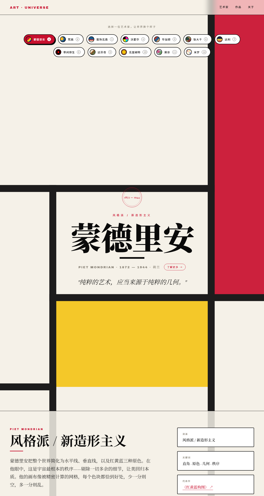

### 梵高 Vincent van Gogh · 后印象派
旋转的星云、火焰柏树、金黄麦田——燃烧的笔触。
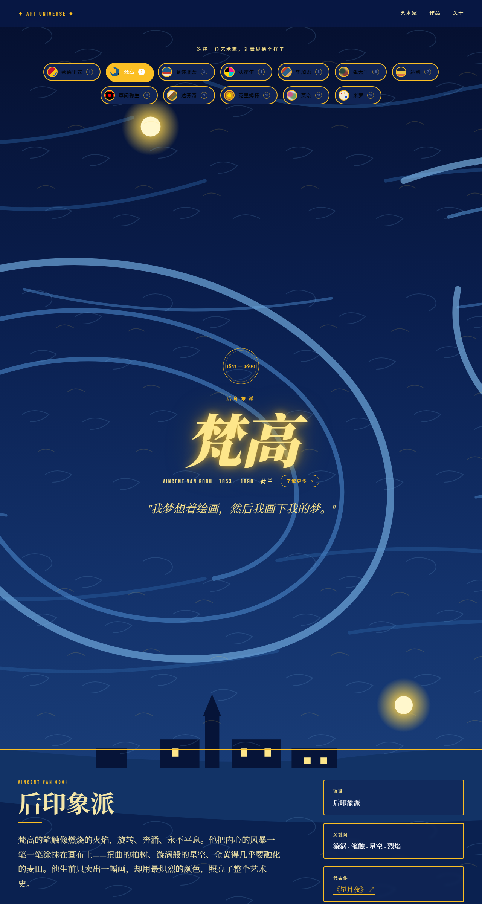

### 葛饰北斋 Hokusai · 浮世绘
普鲁士蓝巨浪的爪状泡沫，与小富士山永恒对峙。
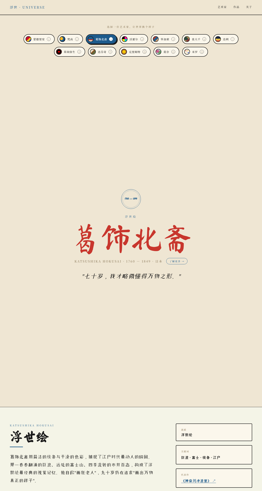

### 沃霍尔 Andy Warhol · 波普艺术
丝网印刷的撞色重复，把消费时代搬进美术馆。
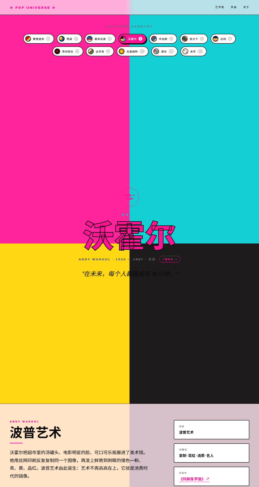

### 毕加索 Pablo Picasso · 立体主义
多视点几何切割，正面与侧面同时出现在一张脸上。
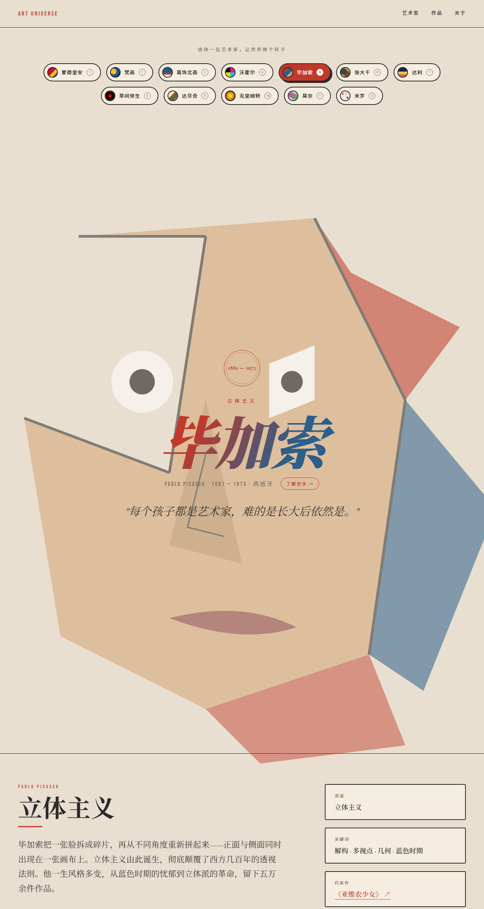

### 张大千 Zhang Daqian · 泼墨泼彩
石青石绿在宣纸上自然流淌，五百年来一大千。
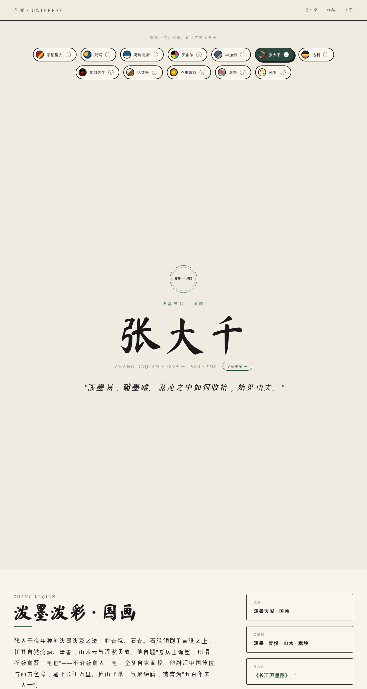

### 达利 Salvador Dalí · 超现实主义
融化的钟表、长腿大象、清醒的梦境。
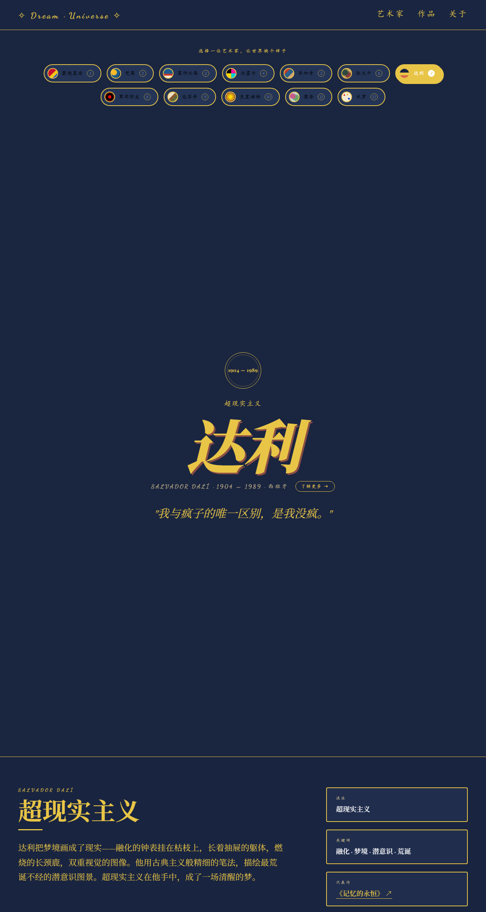

### 草间弥生 Yayoi Kusama · 当代艺术
红黑波点无限增殖，自我消融于无尽图案。
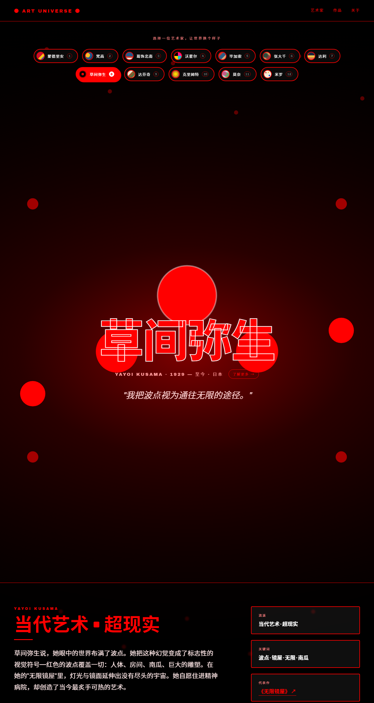

### 达芬奇 Leonardo da Vinci · 文艺复兴
晕涂法的神秘微笑，与反写镜像手稿里的维特鲁威人。
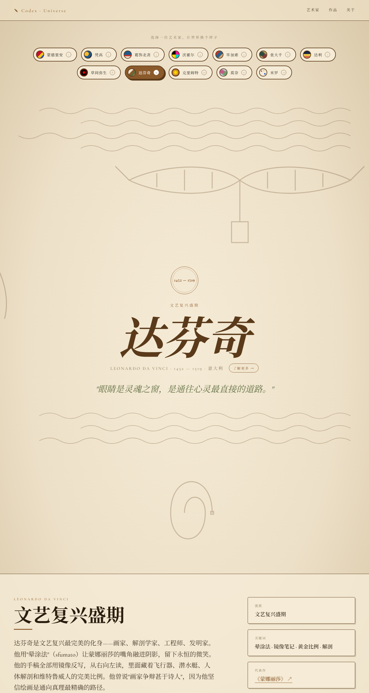

### 克里姆特 Gustav Klimt · 维也纳分离派
黄金马赛克与螺旋漩涡，肉体真实与装饰抽象奇妙并存。
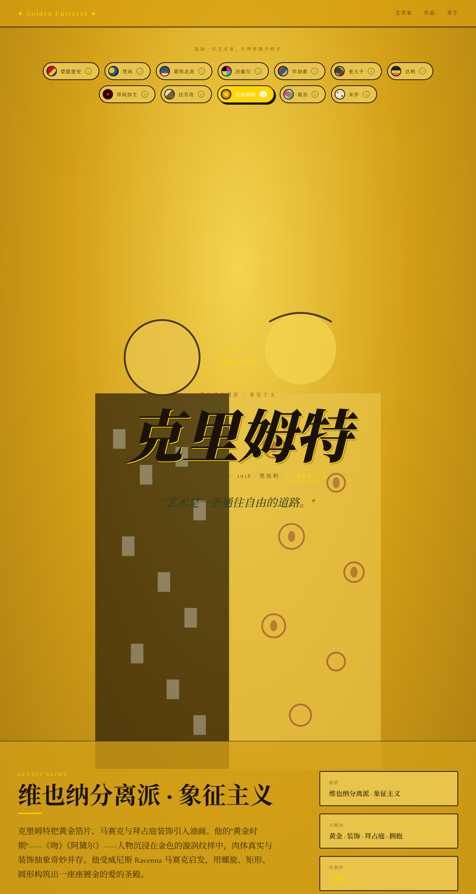

### 莫奈 Claude Monet · 印象派
细碎颤动的色斑，远处看去才能融成朦胧的真实。
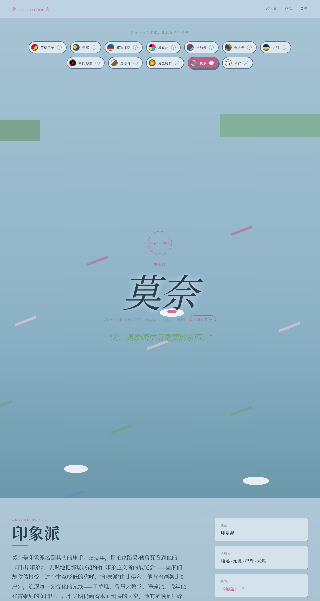

### 米罗 Joan Miró · 超现实抽象
孩童般的笔触画出整个宇宙——红色太阳、蓝色星星、黑色眼睛。
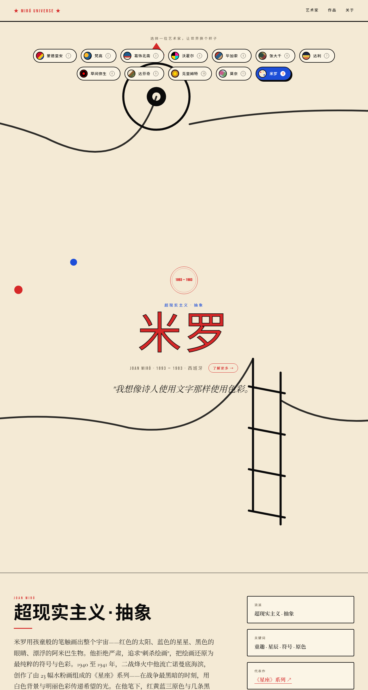

## 🚀 使用方式

无需构建、无需依赖。直接用浏览器打开 `index.html` 即可。

```
git clone <仓库地址>
cd 17
# 双击 index.html，或用浏览器打开
```

### 交互方式

| 操作 | 效果 |
|------|------|
| 点击艺术家头像 | 切换到该艺术家主题 |
| 键盘 `1` - `9` | 切换前 9 位艺术家 |
| URL 加 `#vangogh` | 直接打开梵高主题（如 `index.html#vangogh`） |
| hover 画廊作品 | 上浮 + 阴影变色 + 展开作品简介 |
| 点击"了解更多 →" | 跳转该艺术家的百度百科 |

## 🛠 技术栈

- **纯前端**：HTML + CSS + 原生 JavaScript，零依赖、零构建
- **SVG 复刻**：所有画作与背景场景均为内联 SVG，data URI 编码
- **CSS 变量主题系统**：12 套主题通过 `body[data-theme]` 切换，配色/字体/背景全部参数化
- **Google Fonts**：Playfair Display、Cormorant Garamond、Ma Shan Zheng、Bebas Neue 等多语种字体

## 📂 项目结构

```
17/
├── index.html        # 页面结构
├── script.js         # 12 位艺术家数据 + 36 幅 SVG 画作 + 主题切换逻辑
├── styles.css        # 基础样式 + 12 套艺术家主题
├── README.md         # 本文档
└── screenshots/      # 12 张主题截图（实际渲染）
```

## 📐 画廊作品清单（36 幅）

每位艺术家 3 幅代表作，全部 SVG 精绘 + 真实创作年份 + 一句话简介：

| 艺术家 | 作品 |
|--------|------|
| 蒙德里安 | 红黄蓝构图 (1930) · 百老汇爵士乐 (1942—43) · 构图第10号 (1939—42) |
| 梵高 | 星月夜 (1889) · 麦田群鸦 (1890) · 罗纳河上的星夜 (1888) |
| 葛饰北斋 | 神奈川冲浪里 (1831) · 凯风快晴 (1831) · 骏州江尻 (1831) |
| 沃霍尔 | 玛丽莲·梦露 (1962) · 坎贝尔汤罐 (1962) · 黄色香蕉 (1967) |
| 毕加索 | 亚维农少女 (1907) · 格尔尼卡 (1937) · 哭泣的女人 (1937) |
| 张大千 | 泼墨山水 (1965) · 长江万里图 (1968) · 庐山图 (1981—83) |
| 达利 | 记忆的永恒 (1931) · 内战的预兆 (1936) · 天鹅映象 (1937) |
| 草间弥生 | 无限镜屋 (1965) · 南瓜 (1994) · 波点宇宙 (2000s) |
| 达芬奇 | 蒙娜丽莎 (1503—19) · 维特鲁威人 (1490) · 岩间圣母 (1483—86) |
| 克里姆特 | 吻 (1907—08) · 阿黛尔肖像 (1907) · 生命之树 (1909) |
| 莫奈 | 睡莲 (1916—19) · 日出·印象 (1872) · 鲁昂大教堂 (1892—94) |
| 米罗 | 星座系列 (1940—41) · 哈里昆的狂欢 (1924—25) · 蓝色之二 (1925) |

## 📝 说明

- 画作均为 SVG 风格化复刻（致敬），非原作高清图
- 艺术家链接指向百度百科中文词条
- 截图由 Microsoft Edge 无头模式自动渲染生成（1280×2400）
